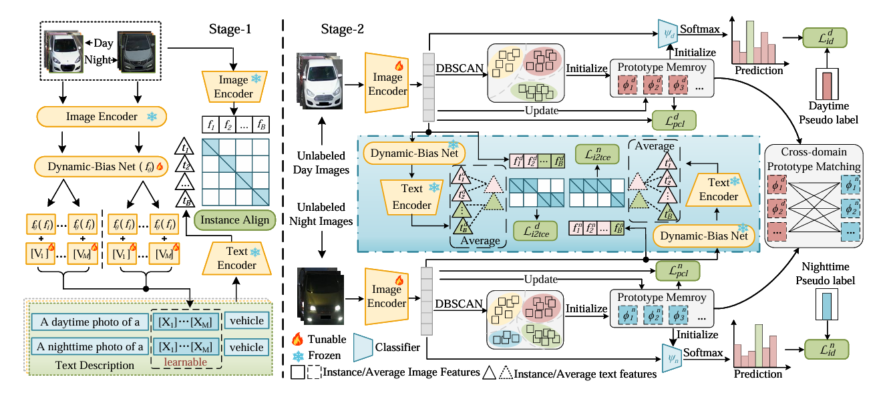

# Bridging Day and Night: Unsupervised Cross-Domain Re-Identification with Synergistic Prompt and Prototype Learning 


We propose a two-stage framework for unsupervised day-night vehicle re-identification. Stage-1 performs instance-aware image-text alignment with a frozen CLIP backbone, a Dynamic-Bias Net, and learnable prompts. Stage-2 introduces intra-domain identity association (IIA) and cross-domain prototype matching (CPM) to establish robust annotation-free correspondences across day and night domains. [paper](https://arxiv.org/abs/2606.12258) 


## Upload History

- 2026/04/06: README released.
- 2026/06/03: Code released.

## Pipeline



Overview of the proposed framework. In Stage-1, the image and text encoders are kept frozen while unlabeled day and night vehicle images are aligned with learnable textual prompts through instance-aware dynamic-bias adaptation. In Stage-2, the image encoder is activated to build domain-specific prototype memory banks, followed by intra-domain identity association and cross-domain prototype matching for annotation-free correspondence learning.

##  Installation

```text
conda create -n dnreid python=3.10 -y

conda activate dnreid

pip install -r requirements.txt
``` 
Please make sure that PyTorch and CUDA are correctly installed according to your local environment.

## Datasets

We use the DN-348 and DN-Wild benchmarks for unsupervised day-night vehicle re-identification.

For convenience, local dataset folders may be named `DN348` and `DNWild` in code or local setups.

```text
datasets/
├── DN348/ (for DN-348) or DNWild/ (for DN-Wild)
│   ├── train_day/
│   ├── train_night/
│   ├── test_day/ (query & gallery)
│   ├── test_night/ (query & gallery)
│   └── train_test_split/
│       ├── train_day.txt
│       ├── train_night.txt
│       ├── test_day.txt
│       └── test_night.txt
```

## Performance

Results on DN-348 and DN-Wild under the unsupervised setting (USL):

| Method | Venue | DN-348 (Day → Night) | DN-348 (Night → Day) | DN-Wild (Day → Night) | DN-Wild (Night → Day) |
|--------|-------|----------------------|----------------------|----------------------|----------------------|
| | | Rank-1 / mAP | Rank-1 / mAP | Rank-1 / mAP | Rank-1 / mAP |
| PGM | CVPR'23 | 57.3% / 31.5% | 65.7% / 32.8% | 41.2% / 19.2% | 39.7% / 22.3% |
| RPNR | ACMMM'24 | 58.7% / 34.7% | 71.0% / 35.3% | 46.7% / 24.8% | 44.2% / 26.1% |
| PCLHD | NeurIPS'24 | 64.8% / 38.7% | 78.4% / 39.5% | 45.3% / 23.2% | 43.5% / 25.1% |
| TokenMatcher | AAAI'25 | 54.9% / 32.3% | 70.2% / 33.1% | 45.5% / 21.8% | 41.5% / 22.9% |
| NULC | AAAI'25 | 63.0% / 38.9% | 75.3% / 38.4% | 45.5% / 22.9% | 41.7% / 23.7% |
| PCA | TIFS'25 | 63.3% / 38.3% | 74.6% / 38.9% | 44.2% / 20.7% | 42.6% / 24.7% |
| Ours | This work | 70.7% / 42.3% | 79.6% / 43.7% | 49.9% / 28.2% | 47.6% / 29.5% |

## Training and Evaluation
Just need to execute this script to run usl_train_pcl.py and make appropriate modifications to the relevant configurations in dn348-vit.yml

### SYSU-MM01 minimal PCL baseline

The independent SYSU baseline uses one shared CLIP ViT image encoder and the
L2-normalized 768-D CLS token. It has no BN neck, prompt/text branch,
projection feature, classifier, or cross-modal loss. Its complete objective is
`PCL_visible + PCL_infrared`.

```bash
python train_sysu_baseline.py --config_file config/sysu-baseline.yml
```

Training records the official all-search and indoor-search 10-trial metrics at
epoch 0 and every evaluation period. Evaluate a saved baseline checkpoint with:

```bash
python train_sysu_baseline.py --config_file config/sysu-baseline.yml \
  --weights output_logs_sysu_baseline/baseline_best.pth --evaluate
```

## Acknowledgement

This repository is built with inspiration from the following works. We sincerely appreciate their contributions to Re-ID and vision-language research.

- [CLIP](https://github.com/openai/CLIP)
- [CLIP-ReID](https://github.com/Syliz517/CLIP-ReID)
- [PCL](https://github.com/RikoLi/PCL-CLIP)


## Citation

If you find this work useful for your research, please consider citing our paper.

```bibtex
@InProceedings{Xu_2026_CVPR,
    author    = {Xu, Jiyang and Liu, Rui and Dai, Hang},
    title     = {Bridging Day and Night: Unsupervised Cross-Domain Re-Identification with Synergistic Prompt and Prototype Learning},
    booktitle = {Proceedings of the IEEE/CVF Conference on Computer Vision and Pattern Recognition (CVPR) Findings},
    month     = {June},
    year      = {2026},
    pages     = {6612-6621}
}
```
